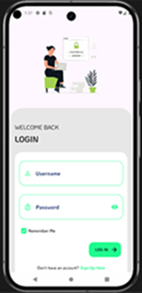

#  Voucher Scan Mobile Application

> Developed by <a href="http://github.com/githiomi">Daniel Githiomi</a>

## Application Description

This is an Android Mobile Application developed using Java, paired with a custom Java SpringBoot API, and connected to a PostgreSQL database. The app allows users to log in with their custom username and password, scan a QR code on a voucher, and redeem it based on its validity. The application provides real-time feedback about the voucher status, whether it's valid, invalid, redeemed, or does not exist.

## Preview

The following is a preview of the application:

## Authentication

Users are required to log in with their custom username and password. Once logged in, users can scan a QR code linked to a voucher for redemption.

Sample login credentials (for testing purposes):

| Username  | Password  |
|-----------|-----------|
| dangit    | dangit123 |

## MINIMUM SYSTEM REQUIREMENTS

* API 30 and above
* 4GB RAM or Higher
* 16GB Internal Storage or Higher

## COMPATIBILITY

Compatible with all Android mobile phones that meet the **minimum API level 30** requirement.

## TECHNOLOGIES USED

This application was developed using the following technologies:

* Java (for Android development)
* Java SpringBoot (for the backend API)
* PostgreSQL (for the database)
* Volley (for API communication)
* Zxing (for QR Code Scanning Functionality)

## KNOWN BUGS

No major bugs reported at the moment. The system is operating as expected.

__Note: Slow internet connection may affect the voucher scanning and redemption process.__

## SETUP INSTRUCTIONS

To set up and run this project locally, follow these steps:

1. **Clone the repository**: 
   Git clone [this](https://www.github.com/githiomi/VoucherScanApp) into your terminal.
2. **Open the folder**:
   Open the folder in your favourite editor, for example Android Studio, using the following syntax. 
3. **Setup**:
   Set up a virtual device with __minimum API Level 30__
   Or download the [.apk](voucherscan.apk) and install directly on a physical device 
4. **Enjoy**:
   Use the __Voucher Scan__ application.

## SUPPORT AND CONTACT INFORMATION

Contact me through any of the following channels:

* Slack: danielgithiomi
* GitHub: githiomi
* LinkedIn: [danielgithiomi](https://linkedin.com/in/daniel-githiomi/)
* Email: <danielgithiomi@gmail.com>

## LICENSES

Click the following to access my license page: [Click-Here](https://githiomi.github.io/Privacy-Policy/)

> Copyright (c) {2024} DhosioLux.
